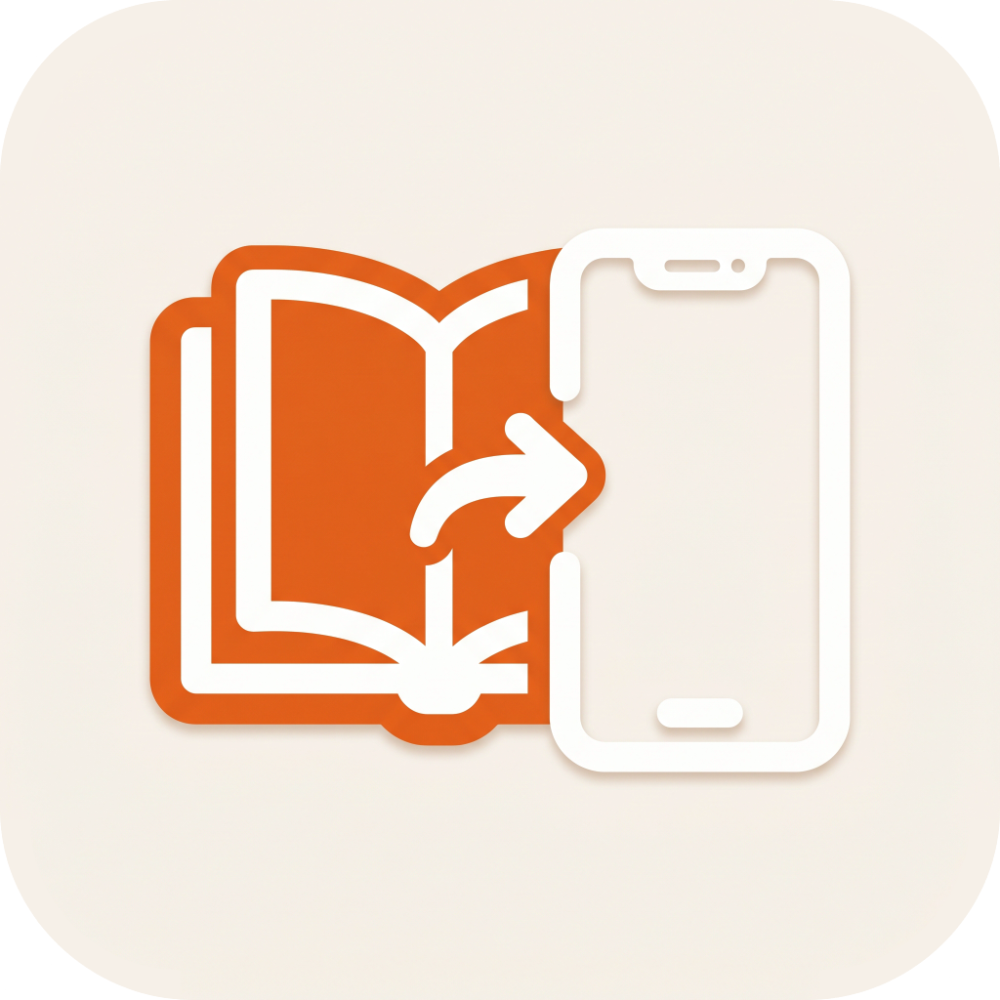

# Send Books to iPhone



Copy audiobooks from a Mac or Windows PC into the [BookPlayer](https://apps.apple.com/app/bookplayer/id1138219998) iPhone app over a USB cable. No iTunes, no cloud, no settings: plug in the phone, drop in your books, done.

It runs as a small page in your web browser, with big text and one job.

- Sends `.mp3`, `.m4a`, `.m4b` and `.zip` files, and whole folders (the folder structure is kept). Everything else is skipped.
- Tells you in plain words what's wrong: phone not plugged in, locked, not trusted, BookPlayer missing, or Apple's software missing on Windows.
- Closes itself a few seconds after you close the browser tab.

## Download

Get the latest version from the **[Releases page](https://github.com/akras14/bookhop/releases/latest)**:

| Computer | File |
|---|---|
| Windows (64-bit) | `bookhop.exe` |
| Mac (Apple Silicon or Intel) | `Send-Books-to-iPhone-mac.zip` |

### Windows setup

1. Install **[Apple Devices](https://apps.microsoft.com/detail/9np83lwlpz9k)** from the Microsoft Store (or iTunes). It provides the driver that lets Windows talk to an iPhone. Restart the PC after installing.
2. Put `bookhop.exe` somewhere permanent, e.g. `Documents\Send Books to iPhone\`.
3. Double-click it. The first time, Windows may say **"Windows protected your PC"** because the app isn't signed. Click **More info**, then **Run anyway**.
4. Optional: right-click `bookhop.exe`, choose **Show more options**, then **Pin to taskbar**.

### Mac setup

1. Unzip `Send-Books-to-iPhone-mac.zip` and drag **Send Books to iPhone** into your Applications folder.
2. The first time you open it, macOS blocks it because it isn't signed with an Apple Developer ID. Go to **System Settings → Privacy & Security**, scroll down and click **Open Anyway**.
3. Optional: drag it from Applications to your Dock.

The app doesn't show a Dock icon while it runs. The browser tab is the whole app.

## How to use it

1. Open **Send Books to iPhone**. Your browser opens the page.
2. Plug in your iPhone with its cable and unlock it. If it asks **"Trust This Computer?"**, tap **Trust** and enter your passcode.
3. When the page says **iPhone connected**, drag books onto the page, or click **Add Files…** or **Add Folder…**.
4. Wait for **Done! Open BookPlayer**, then open BookPlayer on the phone.

**Books not showing up in BookPlayer?** Pull down on BookPlayer's list of books to refresh. BookPlayer only notices new files when it starts, while it's on screen, or when you refresh. If it was sitting in the background, it won't look again on its own.

## Troubleshooting

| What you see | What to do |
|---|---|
| "Plug in your iPhone", but the phone is plugged in and charging | Windows sees power but no data. Unlock the phone and replug it. Try the cable that came with the iPhone (many USB-C cables only charge) in a port on the back of the PC, not a hub. Check that Apple Devices can see the phone; if it can't, see below. |
| Apple Devices doesn't see the phone either | Open **Device Manager** and plug the phone in. If there's no **Apple Mobile Device USB Driver** under *Universal Serial Bus controllers*, right-click **Apple iPhone** → **Update driver** → **Search automatically**, or install the Apple driver from Windows Update → Advanced options → Optional updates. Then restart and try again. |
| "Tap Trust on your phone" but no prompt appears | Unlock the phone and replug it. If someone once tapped *Don't Trust*, reset it on the phone: Settings → General → Transfer or Reset iPhone → Reset → **Reset Location & Privacy**. |
| "Unlock your iPhone" | Unlock the phone with your passcode and wait a moment. |
| "BookPlayer isn't on this iPhone" | Install BookPlayer from the App Store. |
| "Apple's iPhone software isn't installed" (Windows) | Install Apple Devices (see Windows setup) and restart. |

## For developers

It's one Go binary with no cgo. It cross-compiles from macOS to Windows with plain `go build`.

- **iPhone connection:** [go-ios](https://github.com/danielpaulus/go-ios) talks to Apple's USB service: `usbmuxd` on macOS, Apple Mobile Device Service on Windows.
- **Where files go:** go-ios's `house_arrest` service opens BookPlayer's app folder, and files are written into its `Documents` folder, the same place Finder's file sharing puts them. BookPlayer imports from there.
- **The page:** it's embedded with `go:embed` and served on `127.0.0.1:47831`. The page keeps a Server-Sent Events connection open, which also works as the heartbeat: the server exits about 5 seconds after the last tab disconnects. It never exits during an upload.

### Build

```sh
make build          # ./bookhop for this machine
make all            # everything below, into dist/
make windows-amd64  # dist/bookhop.exe: windowed, with icon and version info
make darwin-arm64   # dist/bookhop-darwin-arm64
make darwin-amd64   # dist/bookhop-darwin-amd64
make mac-app        # dist/Send Books to iPhone.app: universal, ad-hoc signed
```

For a plain Windows build, set both variables: `GOOS=windows GOARCH=amd64 go build`. The icon and version info come from `rsrc_windows_amd64.syso`, which only applies to amd64.

### Command line

The same binary has a few commands for testing without the UI. On Windows these print nothing, because the release `.exe` is a windowed app with no console. Use a Mac build.

```sh
./bookhop                    # start the web UI (default)
./bookhop apps               # list apps on the connected iPhone
./bookhop send FILE_OR_DIR…  # send files or folders to BookPlayer
./bookhop ls [FOLDER]        # list BookPlayer's Documents folder
```

Flags: `-bundle ID` (use this BookPlayer bundle ID instead of finding the app by name), `-port N`, `-no-browser`, `-v` (verbose go-ios logging).

### Icons

All icons are generated from `assets/icon-source.jpg`:

```sh
make icons   # assets/icon.png, assets/AppIcon.icns, web/icon.png, rsrc_windows_amd64.syso
```

The outputs are committed, so a normal build doesn't need this step.

### Releasing

1. Bump `VERSION` in the `Makefile`.
2. Run `make icons`, so the version embedded in the `.exe` matches.
3. Commit and push.
4. Run `make release`. It does a clean build of every target and creates GitHub release `vVERSION` with the files attached. It needs the [GitHub CLI](https://cli.github.com/), logged in.

### Project layout

```
main.go            flags and command dispatch
cli.go             apps / send / ls commands
ui.go              web server, device polling, uploads, heartbeat
device/device.go   go-ios wrapper: device state, pairing, house_arrest writes
web/               page HTML, CSS, JS (embedded)
tools/mkicon/      icon generator
assets/            icon source, generated icons, Mac Info.plist
```

## Credits

Built on [go-ios](https://github.com/danielpaulus/go-ios). Not affiliated with BookPlayer or Apple. BookPlayer is made by [Tortuga Power](https://github.com/TortugaPower/BookPlayer).
